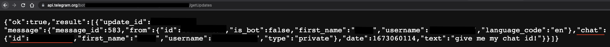

# IP(v4) notifier

This shell script just notifies you on telegram if the IP of the host machine has changed:


## Dependencies

- [curl](https://github.com/curl)
- Telegram bot: [How do I create a bot?](https://core.telegram.org/bots#how-do-i-create-a-bot)

## Set up guide

Clone the repo and change directory to the downloaded folder:
```bash
git clone https://github.com/marcFernandez/ip-notifier.git && cd ip-notifier
```

Give the script execution permissions:
```bash
chmod +x check_ip.sh
```

In order for it to work, you just need to replace the variables noted with `<YOUR_whatever>` in the script. First, obtain
your bot token using @BotFather on Telegram ([guide](https://core.telegram.org/bots/tutorial#obtain-your-bot-token)) and
replace it in the following line:
```bash
# line 8
BOT_TOKEN="<YOUR_BOT_TOKEN>"
```

Then, retrieve your chat id by sending a message to your bot and quickly checking the url
https://api.telegram.org/bot<YOUR_BOT_TOKEN>/getUpdates, replacing *<YOUR_BOT_TOKEN>* by your actual token. You should
see a JSON in the browser:



Replace it in the following line:
```bash
# line 17
CHAT_ID="<YOUR_CHAT_ID>"
```

You can test it by just executing the script:
```bash
./check_ip
```

## Execution

I personally run it using a cron in my Raspberry Pi every 20min, but you can execute it using any other method.

------

Check my site to find more projects!

https://markiff.dev
